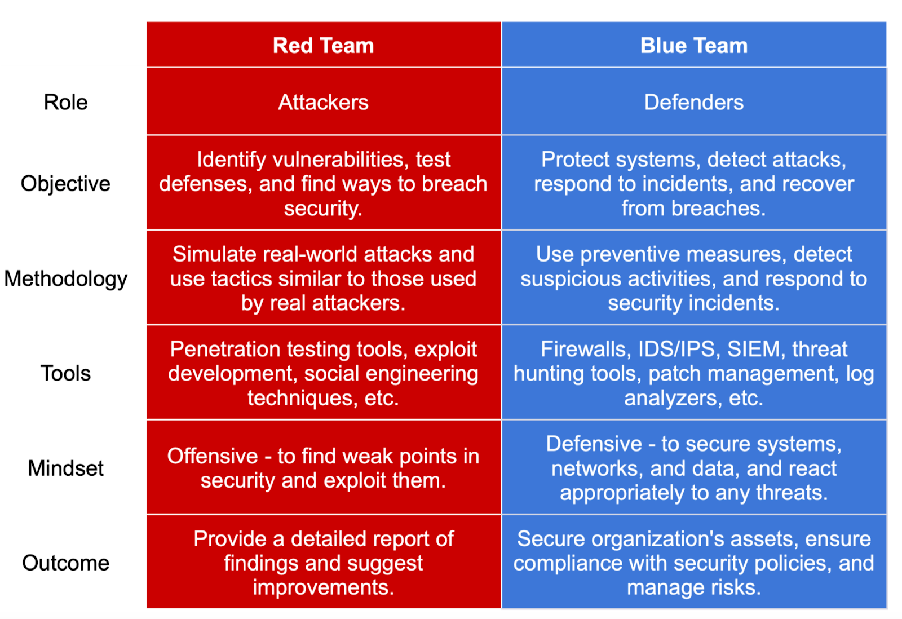

# Overview

## You can achieve a good defensive security with the following points

### Intrusion Detection Systems (IDS)

IDS are software or hardware systems that automate the process of tracking event occurrences within a computer system or network and analysing them for signs of security breaches. They are important in the early warning system.

### Intrusion Prevention Systems (IPS)

The intrusion protection systems (IPS) are the network security devices responsible for examining network and/or system activities looking for malicious or unwanted behaviors and will instantly attempt to stop or prohibit them. These programs have the same features as intrusion detection system and are also able to prevent unauthorized access.

### Security Information and Event Management (SIEM)

The technology known as SIEM analyses security alerts that are produced on an ongoing basis by network hardware and software. It gives a detailed overview of an organisation’s information security.

### Endpoint Detection and Response (EDR)

EDR solutions constantly monitor and collect data about endpoint devices like desktop, laptop systems, tablets, and smartphones. EDR solutions are set up mainly to detect and eradicate suspected threats.

### Antivirus Software

Anti-virus software is a program or a set of programs that are specially designed to prevent the creation or usage of virus files. It can also search for and detect these files in software. Examples of what it can find are viruses, worms, trojans, adware, spy ware etc.

### Firewalls

Firewalls are network security devices which regulate traffic and ensure communication between computer networks. They act as a wall between a private network and the internet, or other networks outside the internal network. Firewalls may have physical or virtual character and they have become indispensable tool for compliance with organizational network security policies.

_source: Overview \[1.\], Overview \[2.\]_

## Crucial Security Defense processes

### Incident Response

Incident response is a systematic approach towards addressing security breaches as well as cyber threats. The primary role of this is to handle, control, and damage mitigation due to a breach.

### Threat Intelligence

Threat intelligence is the type of knowledge that helps an organization gauge any threat to their surrounding environment. it gives context to threats and empowers organizes to decide with conviction.

### Vulnerability Management

Vulnerability management encompasses the practice of identifying exposures as well as evaluating, remediating, and reporting vulnerabilities in systems or software.

### Risk Management

Risk management entails the identification, evaluating and controlling of risks to an organization’s capital and profit. These threats or risks may come from various sources such as financial problems, legal liabilities, poor decision-making, accidents and natural calamities.

_source: Overview \[1.\], Overview \[2.\]_

## Difference to Red Teaming

_source: Overview \[3.\]_

## References

1. <https://picussecurity.com/resource/glossary/what-is-blue-teaming>
2. <https://csrc.nist.gov/glossary/term/blue_team>
3. **img:** <https://lh6.googleusercontent.com/rx-60dcB6d-PkM2PyP3WGhJHMs64U9MZqYZvURexA_uXryKYdBLsgjHpvFsXz1khxNdqXxiQsziaTQ3_-Beyb-mlsmQvelSVw6ADi8TqSB7XtWxa-N01TWGoeJjvpVUXmGsCiP5UBVitXQQ_erdNcns>
