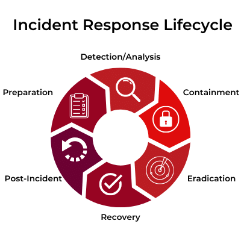

# Incident Response

## Definition

Incident response is an essential part of any cybersecurity strategy in any organization. It is a systematic framework on how to respond to incidents that may occur.

## Example

The example of the incident response plan could be a simple case as data breach. The first step would be detecting the breach, which could be done through system monitoring for uncommon activity. After ascertaining the nature of the breach, the next stage will be to investigate the breach on its own as well as the affected data. During the containment phase, the breach will be isolated to avoid its spread. During the termination phase, the malware would be removed, as its cause. The recovery phase was about restoring damaged systems to normal operation. At last, there would be post-incident activities that involve reporting the breach to appropriate agencies and learning from the breach to avoid its recurrence in the future.

## Incidident Response Plans

An Incident Response Plan is a documented, tested, and implemented plan that provides the organization with a structured approach for handling cybersecurity incidents.
Incident Response plans are often tested through exercises known as table-top exercises. These exercises involve simulating a breach and practicing the steps of the incident response plan. They can help identify weaknesses in the plan and ensure that all members know what they have to do in a real scenario.

## Incident Response Life Cycle

_source: Incident Response \[3.\], Incident Response \[1.\], Incident Response \[2.\]_

## References

1. <https://www.techtarget.com/searchsecurity/definition/incident-response#:~:text=Incident%20response%20is%20an%20organized,recovery%20time%20and%20total%20costs>.
2. <https://www.ibm.com/de-de/topics/incident-response>
3. **img:** <https://criticalfault.com/wp-content/uploads/2022/03/Incident-Response-Lifecycle-black-text.png>
