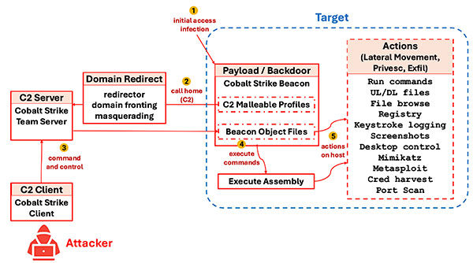

# Remote Access Trojans

The very basic idea of a RAT is that you have a program on the victim computer that executes commands sent to it, this is typically done with C2 (Control and Command) Infrastructure. These frameworks can be scaled up to be very flexible and sophisticated, with the most famous one being [Cobalt Strike](https://www.cobaltstrike.com/).

## Infection

Being classified as trojans that pretty much tells us how hosts are infected, that means there are not that many different methods we have to worry about:

- Classic Trojan: Might be bundled with cracked or [shady](https://www.youtube.com/watch?v=eKfZmcvo_2g) software since the user typically has to grant admin permissions for this. Another notable example is the use of a [trojanised RAT builder](https://www.cloudsek.com/blog/no-honour-among-thieves-uncovering-a-trojanized-xworm-rat-builder-propagated-by-threat-actors-and-disrupting-its-operations).
- Phishing: Every now and then a new way of executing code using various windows features is found, from there the attacker just has to send it to HR departments and hope at least one of them actually executes.
- Supply Chain Attack: There have been more of those, each getting more sophisticated. Sometimes it is easy to sneak malicious code poorly monitored repos or package managers, but there are also sophisticated attacks on FOSS from state actors, often with years of preparation.

## Operation

Depending on the target, the actual goal of the RAT can vary significantly:

- When targeting regular users the data is on the same computer that gets infected so the operations get easier to the point of technically not even needing to have a C2 to run remote commands or even persistence. This then gets into infostealer territory, which is far easier and typically carries close to zero risk for the attacker.

- That changes when targeting companies, the sensitive data is typically not on the point of infection so there need to be more exploitation steps to actually get access to servers and exfiltrate or deploy ransomware.

## Infostealers

They can be classified as a subcategory of RATs that don't actually provide remote access but rather just perform a few predefined actions and then delete themselves or run until the system restarts.

Out of anything mentioned in this module, this is by far the most relevant threat to actual users because it is far easier to make and the lack of awareness most computer users exhibit makes it easy for attackers. Even calling them attackers is generous because copy-pasting existing stealers is extremely common particular corners of the internet.

They typically rely on basic social engineering to deploy, often being spread via discord as:

- Game Cheats/Mods
- "Try my game" type social engineering

### Targets

The usual files, basically anything an attacker can use down the line for profit:

- Auth tokens (Discord, Steam, etc.)
- Password Vaults (Browser or Password manager)
- Browser Cookies
- Clipboard
- Screenshots

### Basic Structure

One of the key components that make infostealers so accessible are [webhooks](https://www.redhat.com/en/topics/automation/what-is-a-webhook), they let you exfiltrate data somewhat anonymously and usually for free.

The typical runtime is very simple:

1) Scan for target files.
2) Extract the important information.
3) Send to webhook.

Because of the simple structure and intended targets they are usually not that heavily obfuscated, [PyInstaller](https://pyinstaller.org/en/stable/) or simple Java obfuscators are the most complicated techniques you can expect here.

## Real RATs

They differ from the Infostealers not only in increased complexity but also in targets, they are getting used in more focussed attacks on high value targets where code execution actually matters.

Particularly with the rise of Cybercrime-as-a-Service it has become easier to obtain high complexity RATs, they are typically used to escalate into Databreaches or Ransomware.

One especially interesting use is the target of infrastructure or [SCADA](https://en.wikipedia.org/wiki/SCADA) devices, this requires handcrafted payloads and is thus typically only performed by APTs and leveraged for profit or other international purposes.

While it was still profitable, installing crypto miners was common , but that has become less profitable compared to the detection risk. Obligatory funny: https://github.com/xmrig/xmrig/issues/730

### Infrastructure

One of the key differences from infostealers is the required infrastructure for RATs to function, an attacker needs to be able to handle many infected computers and the communication between the C2 server and the hosts must remain undetected.

We already mentioned Cobalt Strike, perhaps the most famous RAT framework, with many threat actors using either the real version or cracked trial versions.
For most attacks it is perfectly sufficient to use an existing C2 framework, rolling your own seems to be preferred in more sophisticated attacks.

A key part to hide the presence of a RAT is to obfuscate the traffic to the C2 server, this can be done with [Domain Fronting](https://en.wikipedia.org/wiki/Domain_fronting) or [Fast Flux](https://en.wikipedia.org/wiki/Fast_flux). Obfuscation the traffic like this works because most detection mechanism rely on signatures or known C2 servers, so by using a CDN or other large service the traffic is harder to detect. But it is important to note that the goal is only to remain undetected just long enough to do whatever the initial goal was, getting detected does not matter once data has been stolen or ransomware deployed.

While hiding the location of the C2 is important, you usually also want to hide the traffic on the network, abusing DNS seems to be at least [somewhat common](https://unit42.paloaltonetworks.com/dns-tunneling-how-dns-can-be-abused-by-malicious-actors/#section-3-title) with the available samples.

One term that is often used in the context of RATs is "Beaconing", this is the process of the infected host sending a signal to the C2 server to indicate that it is still alive and ready to receive commands. 

Firewalls and other Intrusion Detection Systems keep evolving and as with everything else, this is pretty much a cat and mouse game. Some reading on ongoing detection here: https://unit42.paloaltonetworks.com/c2-traffic/ and https://www.netskope.com/netskope-threat-labs/effective-c2-beaconing-detection

### Techniques

Because we are trying to remain undetected in usermode with persistence, the malware needs to be at least somewhat decent.
A few years ago you could just disable the AV and leave it at that but nowadays that will already set of alarms.

But because Windows has a lot of "legacy code" there are many ways to establish persistence:
- Registry HKCU: Simple but also easy to detect.
- Startup Folder: Why is this even a thing?
- Scheduled Task: `schtasks` command lets you do this with lots of flexibility.
- DLLs: There are a few different options here depending on your privilege but a popular one is to abuse the [Windows DLL load order](https://learn.microsoft.com/en-us/windows/win32/dlls/dynamic-link-library-search-order). Example: [Xeno RAT](https://otx.alienvault.com/pulse/65ddf674e5b73a7b24306fde).

More about persistence [here](https://swisskyrepo.github.io/InternalAllTheThings/redteam/persistence/windows-persistence/).

Regarding AV evasion, you can go as fancy as you want but in the end it usually comes down to just dodging a signature detection unless you are a nation state actor. One of the things you will want to think about is sandbox detection as it might buy at least a little time.

## Examples

- [Discord Bot Infostealer](https://www.trellix.com/blogs/research/java-based-sophisticated-stealer-using-discord-bot-as-eventlistener/)
- [RAT builder RAT](https://cyberpress.org/weaponized-xworm-rat-builder-targeting-script-kiddies/)