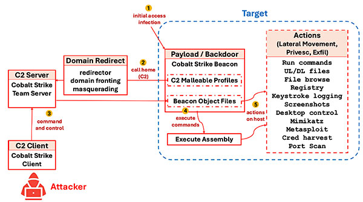

# **RATs and Rootkits**

- Remote Access
  
- Backdoors

---

# **RATs**

- Remote Access Trojans
  
- Infostealers
  
- Operationally similar to legitimate tools

---

# **Infostealers**

- *x* got ratted -> Usually just an infostealer
  
- Basic social engineering
  
- Steals tokens, passwords, cookies, etc.
  
- VERY poplar in communities with lots of *young people*
  
- No infra, relies heavily on webhooks or similar

---

# **Real RATs**

- More complex, requires C2 infra
  
  - Not worth for individual targets
  
- Can pivot into Ransomware or related

---

# **RAT Operation**

1) Entry via social engineering
   
2) *current cve* or *0day* to escalate
   
3) Install and start beaconing
   
4) Profit

---

# **Command and Control (C2)**

- Recieve and execute commands
- Exfiltrate data
- Commercial or custom frameworks

---

# **C2 Communication**

- Beaconing
  - host -> C2
- Crawling
  - C2 -> known hosts
- Traffic obfuscation
  - Redirection
  - C2 over DNS
  - Encryption
  - Mallealbe traffic

---

# **More traffic obfuscation**

- Domain Fronting
- Fast Flux
- DNS Tunneling
- Other generic traffic obfuscation

---

# **Persistence**

- Registry
- Startup
- Scheduled Tasks
- DLLs

---

# **Protection**

    

        <h3>Prevent infection</h3>
        <ul>
            <li>User training</li>
            <li>Patching</li>
            <li>Minimal permissions</li>
        </ul>
    

    

        <h3>Detect</h3>
        <ul>
            <li>Monitor traffic</li>
            <li>EDR monitoring</li>
        </ul>
    

---

# **Examples**

- [Discord Bot Infostealer](https://www.trellix.com/blogs/research/java-based-sophisticated-stealer-using-discord-bot-as-eventlistener/)
- [RAT builder RAT](https://cyberpress.org/weaponized-xworm-rat-builder-targeting-script-kiddies/)

---

# **Rootkits**

- Backdoor with typically elevated privileges
- Traditionally requires permissions and/or exploit to install

---

# **Types of Rootkits**

<!-- With only markdown it inserts weird line breaks -->

    

        <ul>
            <li>Userland
                <ul>
                    <li>First type of rootkits</li>
                    <li>Replace glibc, etc.</li>
                </ul>
            </li>
            <li>Kernel
                <ul>
                    <li>Permissions or exploit required</li>
                    <li>Nowadays more protections</li>
                </ul>
            </li>
            <li>Firmware/BIOS/Hypervisor
                <ul>
                    <li>Very rare and complex</li>
                </ul>
            </li>
        </ul>
    

    

        
    

---

# **Mobile Rootkits**

- State spyware may fall into this category
- Root/jailbreak usually included
- Very rare due to cost of required vulns

---

# **Why Ring0**

- Normally invisible from userspace
- Manipulate structures and install hooks
- Can be detected by earlier/deeper code

---

# **Kernel Protections**

- Non-exposed symbols
- KASLR & SMAP
- Write protection
- Exploit protections
- Integrity checks
- Still not perfect

---

# **Firmware/BIOS/ Hypervisor**

- Functionally similar to enterprise management software
- Requires high severity vuln to install
- Might start to become more common

---

# **Examples & Reading**

- [Recent Kernel+Userland Rookit](https://www.bleepingcomputer.com/news/security/new-stealthy-pumakit-linux-rootkit-malware-spotted-in-the-wild/)
- [Cosmic Strand UEFI Bootkit](https://securelist.com/cosmicstrand-uefi-firmware-rootkit/106973/)
- [Rootkit Arsenal](https://books.google.com/books/about/The_Rootkit_Arsenal.html?id=aJFVCnwNbMEC)
- [Rootkits and Bootkits](https://nostarch.com/rootkits)

